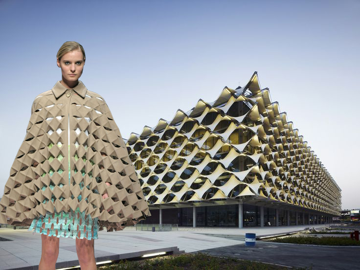

title: Microservices vs Monoliths
class: wrapper <!-- , animation-fade -->
layout: true

---

class: wrapper, center, middle

# {{title}}

---

class: wrapper, center, middle

# Piotr Gaczkowski

<https://github.com/DoomHammer> | <svg aria-hidden="true" focusable="false"
data-prefix="fab" data-icon="twitter" class="svg-inline--fa fa-twitter fa-w-16"
role="img" xmlns="http://www.w3.org/2000/svg" viewBox="0 0 512 512" height="1em"><path fill="currentColor" d="M459.37 151.716c.325 4.548.325 9.097.325 13.645 0 138.72-105.583 298.558-298.558 298.558-59.452 0-114.68-17.219-161.137-47.106 8.447.974 16.568 1.299 25.34 1.299 49.055 0 94.213-16.568 130.274-44.832-46.132-.975-84.792-31.188-98.112-72.772 6.498.974 12.995 1.624 19.818 1.624 9.421 0 18.843-1.3 27.614-3.573-48.081-9.747-84.143-51.98-84.143-102.985v-1.299c13.969 7.797 30.214 12.67 47.431 13.319-28.264-18.843-46.781-51.005-46.781-87.391 0-19.492 5.197-37.36 14.294-52.954 51.655 63.675 129.3 105.258 216.365 109.807-1.624-7.797-2.599-15.918-2.599-24.04 0-57.828 46.782-104.934 104.934-104.934 30.213 0 57.502 12.67 76.67 33.137 23.715-4.548 46.456-13.32 66.599-25.34-7.798 24.366-24.366 44.833-46.132 57.827 21.117-2.273 41.584-8.122 60.426-16.243-14.292 20.791-32.161 39.308-52.628 54.253z"></path></svg> [@doomhammerng](https://twitter.com/doomhammerng)

<https://doomhammer.info>

### <https://doomhammer.info/talks/abe2021>

---

# Modern architecture

---

# Fashion

???

Fashion comes and goes. Features stay.

People in tech are especially funny, cause they're all about "we're taking
rational  decisions based on merit here" and only then jump on the emotional
fashion bandwagon.

"Ooooooh, this Kubernetes so shiny! Me wants!"

---

# Looking at role models

---

# Looking at role models

--

- Spotify => Tribes, Squads

--

- Google => Kubernetes, Golang

--

- Netflix => Microservices

---

# Microservices?

--

Not yet, sorry

---

# Architecture

---

# Architecture

--

Blueprints and mortar

--

Builders have thousands of years of experience which led to best practices

--

We have around 70 years, less than one lifespan

---

class: wrapper, center, middle

# Conway's Law

--

### "Any organization that designs a system (defined broadly) will produce a design whose structure is a copy of the organization's communication structure."

---

# Software Architecture

---

# Software Architecture

--

- At the beginning there was nothing but a monolith

--

- Then came the Operating System

--

- ...with system libraries

--

- ...and independent programs

--

- ...but still more or less monoliths

---

# Monoliths?

--

Not yet, sorry

---

# Challenges of Software Architecture

--

- We're not building cathedrals (or: leaky abstractions)

--

- We're building quickly mutating transformers that live in a world that's evolving at breakneck speed

--

- Waterfall is not agile enough

--

- Monoliths are software equivalents of cathedrals

---

class: wrapper, center, middle

# Monoliths

Monolithos => one stone

???

Not easy to modify

If the market doesn't want it, you need to get a new one

Not sustainable if fashion changes quickly

---

# Challenges of monoliths

--

One feature change is entire monolith change

--

Therefore it's better to not change it too often

--

But fashion changes!

--

Agile is about features and market needs (aka fashion)

--

Release early, release often

---

# Can we be agile with monoliths?

--

Yes!

--

Especially if you're Obelix!

---

# Some big players are OK with monoliths

--

- Example: Facebook (single monolithic binary of several GiB)

--

---

# Can we be agile with monoliths?

--

There's risk involved:

- updating one feature may break the entire system

---

# Becoming Agile

Independent features require independent teams

--

Independent teams require independent subsystems

--

Test each subsystem then integrate

--

Loosely coupled subsystems can be released independently

---

# Conway's Law Reprise

???

System's structure follows org structure

--

Break the monolith into separate features then connect the features together

---

class: wrapper, center, middle

# Welcome to microservices!

---

# Microservices

--

Independent loosely coupled pieces of software

--

Responsible for single features

--

UNIX philosophy in a distributed world (do one thing and do it well)

--

Microservices are more agile => less need to sync with other teams

---

# So they're definitely better than monoliths, right?

--

## That's what all the trendy magazines want us to think!

---

# Microservices

Pros

- choosing the tools appropriate for the job
- autonomous teams
- continuous deployment
- shorter feedback loop
- more space for experiments

???

NodeJS, Golang, Python, C++

Teams know their domain and their frameworks, not necessarily the entire
environment

Easy to test

Easy to put behind a load-balancer and deploy in a non-diruptive fashion

Release can be fast and so does rollback (the magic of Facebook)

---

# What are the costs?

--

## Features microservice designers won't tell you about!

---

# Microservices

Cons:

- organizational overhead
- technological overhead
- multiple toolchains => lack of understanding

???

instead of a single QA team, multiple QA experts in each team

communication, protocols, network bandwidth, data storage, CPU, memory

---

# Shall we switch to microservices?

--

Probably!

---

class: wrapper, center, middle

# Conway's Law Strikes Again!

---

# Shall we switch to microservices?

1: Is your organizational structure ready for microservices?

---

# Is your organizational structure ready for microservices?

--

Microservices + monolithic organizational structure = distributed monolith

--

All the cons of monoliths but with all the cons of microservices (no pros for you this time, sorry)

--

Lots of overhead, no agility, lots of headache

--

Wanna go microservices? Change your org first!

---

# Is your organizational structure ready for microservices?

--

Don't break you monolith into tiny pieces

--

Instead add new features as separate microservices

--

Following role models blindly can be harmful!

---

# Shall we switch to microservices?

2: Your org is fine, but can you afford it?

---

# Your org is fine, but can you afford it?

--

Big players can afford to hire domain experts with diverse expertise

--

Organizational overhead is not scary (profit margins are fine after all)

--

Technical overhead? We'll buy more machines (it's peanuts when you're dealing with billions of USD)

--

For big players these costs are marginal, while the advantage is really big (quicker releases + shorter feedback => more revenue)

--

For small apps and small companies the costs are significant, while the advantage not that pronounced

---

# Should I switch to microservices?

1. Change your org
2. Use the calc

---

# Experiment!

--

- Learn from the leaders
- Understand their challenges
- Admit you're facing different challenges
- Adapt

---

class: wrapper, center, middle

# May your architecture follow fashion!

---

class: center, middle, split50

# Hungry for more?

.left-pane[
  
]
.right-pane[
.left[
Check out the book

Featuring:
- More on architectural styles
- Designing quality software
]
]

---

# Questions?

---

class: center, middle

# Thank you!

<https://github.com/DoomHammer>

<https://doomhammer.info>

### <https://doomhammer.info/talks/abe2021>

---

# Attributions

- 

- 

- 

- 

- 

- [Márcio Cabral de Moura](https://www.flickr.com/photos/mcdemoura/2967645636)
  "Obelix and Dogmatix"

- 

- 

- 

- [Viktoria
  Lytra](https://www.archdaily.com/902370/does-form-follow-fashion-viktoria-lytras-montages-keep-iconic-architecture-in-vogue)
  "Form Follows Fashion"
