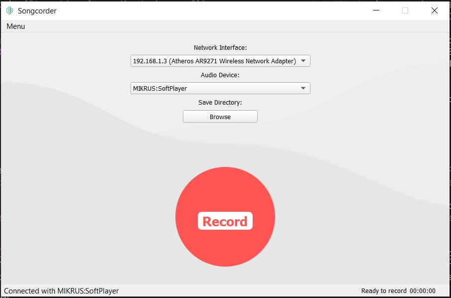

title: Building portable C++ packages: the&nbsp;Curse of Abundance
class: wrapper
layout: true

---

layout: none

background-image: url(img/title.jpg)

---

class: wrapper, center, middle

# Piotr Gaczkowski


<https://github.com/DoomHammer> | <svg aria-hidden="true" focusable="false"
data-prefix="fab" data-icon="twitter" class="svg-inline--fa fa-twitter fa-w-16"
role="img" xmlns="http://www.w3.org/2000/svg" viewBox="0 0 512 512" height="1em"><path fill="currentColor" d="M459.37 151.716c.325 4.548.325 9.097.325 13.645 0 138.72-105.583 298.558-298.558 298.558-59.452 0-114.68-17.219-161.137-47.106 8.447.974 16.568 1.299 25.34 1.299 49.055 0 94.213-16.568 130.274-44.832-46.132-.975-84.792-31.188-98.112-72.772 6.498.974 12.995 1.624 19.818 1.624 9.421 0 18.843-1.3 27.614-3.573-48.081-9.747-84.143-51.98-84.143-102.985v-1.299c13.969 7.797 30.214 12.67 47.431 13.319-28.264-18.843-46.781-51.005-46.781-87.391 0-19.492 5.197-37.36 14.294-52.954 51.655 63.675 129.3 105.258 216.365 109.807-1.624-7.797-2.599-15.918-2.599-24.04 0-57.828 46.782-104.934 104.934-104.934 30.213 0 57.502 12.67 76.67 33.137 23.715-4.548 46.456-13.32 66.599-25.34-7.798 24.366-24.366 44.833-46.132 57.827 21.117-2.273 41.584-8.122 60.426-16.243-14.292 20.791-32.161 39.308-52.628 54.253z"></path></svg> [@doomhammerng](https://twitter.com/doomhammerng)

<https://doomhammer.info>

---

class: wrapper, center, middle

# {{title}}

---

class: twitter

# How to build C++ code?

--

- Makefile

--

- Shell scripts

---

class: twitter

# What about cross-platform compatibility?

--

- Autoools

--

- Scons

--

- Bazel

--

- Meson

--

- Waf

---

class: twitter

# Maybe some IDE support?

--

- QMake

--

- CMake

---

class: twitter

# Building an app with some Open Source dependencies

---



---

class: twitter

# Dependency management

--

- dependencies built with different build tools (Makefiles and Waf mostly)

--

- resolution using an in-house helper script and AWS S3 buckets

--

- but deps should also work with source deps

---

class: twitter

# Choosing a build tool for an app

---

class: twitter

# CMake

--

- Builds on different platforms are easy (most of the time)

--

- Cross-compilation supported

--

- De facto standard

---

class: twitter

# How to handle the deps?

--

- Lots of `ExternalProject`s!

--

- Building each from source

--

- Handling build systems by abusing CMake

--

- audio conversion with `system("sox")`

---

class: twitter

```cmake
ExternalProject_Add(
  depX
  PREFIX deps
  DEPENDS depY depZ
  GIT_REPOSITORY https://github.com/depX/depX.git
  GIT_TAG depX_1.0.33
  UPDATE_COMMAND ""
  PATCH_COMMAND sed -i -e s/1.4.176/1.6.216/ data/dependencies.json \
    && sed -i -e "s/(kError/(kSeverityError/" some.cpp
  CONFIGURE_COMMAND ./in-house fetch --all && \
    ./waf configure --depY=../depY
  BUILD_COMMAND ./waf build
  INSTALL_COMMAND ""
  BUILD_IN_SOURCE 1
  )
```

---

class: twitter

# What I didn't like

--

- Long build times

--

- Missing binary deps

--

- Version drift

--

- Commands for different platforms set as variables

---

class: twitter

# Commands for different platforms set as variables

```cmake
elseif(WIN32)
  set(X_TOOL X.bat)
  set(WAF_TOOL waf.bat)
  set(MAKE_PRG make.bat)
  set(WAF_ARGS --msvc_version="msvc 12.0")
  set(X_PLATFORM Windows-x86)
  set(DIR_SEP \\)
  set(LSLR_CMD dir /s /b)
else()
```

---

class: twitter

# Time to clean up!

---

class: twitter

# Enter Conan

--

- FLAC and spdlog installed from Conan

--

- Drop external sox binary

---

class: twitter

# conanfile.txt

```ini
[requires]
flac/1.3.3
spdlog/[>=1.4.1]

[generators]
cmake
```

---

class: twitter

# CMakeLists.txt

```cmake
include(${CMAKE_BINARY_DIR}/conanbuildinfo.cmake)

conan_basic_setup()

target_link_libraries(
  songcorder
  [...]
  ${CONAN_LIBS}
  )
```

---

class: twitter

# Results?

--

- Easier to build

--

- Easier to package!

---

class: twitter

# More cleaning up

--

- Travis configuration for dependencies

--

- pre-built binaries

--

- hosted on GitHub

---

class: twitter

# Results?

--

- better control

--

- quicker builds of the app

---

class: twitter

# Packaging

--

- Qt Deploy

--

- NSIS for Windows

--

- DMG for Mac

--

- What to do for Linux?

---

class: twitter

# Linux packaging

--

- AppImage

--

- Flatpak

---

class: twitter

# AppImage

- Feels more intuitive

- Requires builds on machines with ancient glibc

---

class: twitter

# Next steps?

--

- Conan for the deps!

--

- Streamline Linux packaging

--

- Clean up and modernize the code

---

class: twitter

# What did I learn?

--

- Building is a mess

--

- It's getting better

--

- Packaging on Linux is *hard*

--

- Poor tech can still yield a fine product

---

class: twitter

# Questions?

---

class: wrapper, center, middle

# Thank you!


<https://github.com/DoomHammer> | [@doomhammerng](https://twitter.com/doomhammerng)

<https://doomhammer.info>

### <https://doomhammer.info/talks/accuspring2021>
