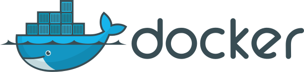

title: Docker 💚 C++
class: wrapper
layout: true

---

class: wrapper, center, middle

# {{title}}

---

class: wrapper, center, middle

# Adrian Ostrowski


<https://github.com/aostrowski> | <svg aria-hidden="true" focusable="false"
data-prefix="fab" data-icon="twitter" class="svg-inline--fa fa-twitter fa-w-16"
role="img" xmlns="http://www.w3.org/2000/svg" viewBox="0 0 512 512" height="1em"><path fill="currentColor" d="M459.37 151.716c.325 4.548.325 9.097.325 13.645 0 138.72-105.583 298.558-298.558 298.558-59.452 0-114.68-17.219-161.137-47.106 8.447.974 16.568 1.299 25.34 1.299 49.055 0 94.213-16.568 130.274-44.832-46.132-.975-84.792-31.188-98.112-72.772 6.498.974 12.995 1.624 19.818 1.624 9.421 0 18.843-1.3 27.614-3.573-48.081-9.747-84.143-51.98-84.143-102.985v-1.299c13.969 7.797 30.214 12.67 47.431 13.319-28.264-18.843-46.781-51.005-46.781-87.391 0-19.492 5.197-37.36 14.294-52.954 51.655 63.675 129.3 105.258 216.365 109.807-1.624-7.797-2.599-15.918-2.599-24.04 0-57.828 46.782-104.934 104.934-104.934 30.213 0 57.502 12.67 76.67 33.137 23.715-4.548 46.456-13.32 66.599-25.34-7.798 24.366-24.366 44.833-46.132 57.827 21.117-2.273 41.584-8.122 60.426-16.243-14.292 20.791-32.161 39.308-52.628 54.253z"></path></svg>[@adr_ostrowski](https://twitter.com/adr_ostrowski)

<http://aostrowski.github.io>

---

class: wrapper, center, middle

# Piotr Gaczkowski


<https://github.com/DoomHammer> | <svg aria-hidden="true" focusable="false"
data-prefix="fab" data-icon="twitter" class="svg-inline--fa fa-twitter fa-w-16"
role="img" xmlns="http://www.w3.org/2000/svg" viewBox="0 0 512 512" height="1em"><path fill="currentColor" d="M459.37 151.716c.325 4.548.325 9.097.325 13.645 0 138.72-105.583 298.558-298.558 298.558-59.452 0-114.68-17.219-161.137-47.106 8.447.974 16.568 1.299 25.34 1.299 49.055 0 94.213-16.568 130.274-44.832-46.132-.975-84.792-31.188-98.112-72.772 6.498.974 12.995 1.624 19.818 1.624 9.421 0 18.843-1.3 27.614-3.573-48.081-9.747-84.143-51.98-84.143-102.985v-1.299c13.969 7.797 30.214 12.67 47.431 13.319-28.264-18.843-46.781-51.005-46.781-87.391 0-19.492 5.197-37.36 14.294-52.954 51.655 63.675 129.3 105.258 216.365 109.807-1.624-7.797-2.599-15.918-2.599-24.04 0-57.828 46.782-104.934 104.934-104.934 30.213 0 57.502 12.67 76.67 33.137 23.715-4.548 46.456-13.32 66.599-25.34-7.798 24.366-24.366 44.833-46.132 57.827 21.117-2.273 41.584-8.122 60.426-16.243-14.292 20.791-32.161 39.308-52.628 54.253z"></path></svg> [@doomhammerng](https://twitter.com/doomhammerng)

<https://doomhammer.info>

---

# Agenda

- Docker refresher: consuming and producing packages
- building C++ applications using CMake
- packaging C++ code inside Docker
- multi-stage builds
- debugging C++ code inside containers

<!--

Opis:

Building C++ using different toolchains should be easy. Reproducing your build, test, and production environment shouldn't be hard either. If you assume this is just wishful thinking, this is a talk for you. If you don't, come listen how, thanks to Docker, it's easy to make those things a bliss.

In this talk, we'll demonstrate how to containerize your app effortlessly using Docker and CMake. 
What's more, you'll also see how to use Docker to provide a uniform build environment for all your developers. Cross-platform development and reproducible builds have never been easier.
Last but not least, we'll show you how to easily deploy complex applications right on your developer VMs.

Czesc 1:

- paczkowanie przy pomocy Dockera
- współpraca Docker + CMake
- debuggowanie kontenerów

Czesc 2:
- toolchain w Docker
- dodatkowa infra (bazy danych, serwery www, ...) w Dockerze
- Docker Compose
- CI/CD z Docker + C++

-->

---

# Docker



???
- lightweight, helps deal with environment issues
- supported on Linux, Windows, Mac
- helps to apply "cattle, not pets"

---

# Running Docker containers in a nutshell

`docker run -i -t --rm`
--

`-e FOO=bar`
--

`-p 8080:80/udp`
--

`-v /path/on/host:/path/in/container:ro`
--

`image:latest`

---

# Building Docker containers

```bash
docker build . -t image:latest
```

---

# Dockerfile

```dockerfile
FROM ubuntu:rolling
ADD files_from_host path_in_container
RUN apt-get update && \
    apt-get -y install my_package && \
    apt-get autoremove -y && \
    apt-get clean && \
    rm -r /var/lib/apt/lists/*
ENTRYPOINT ["my_command"]
EXPOSE 8080
```

---

# Building C++ code


---

# What we want to achieve

- C++ deliverables built using CMake
- packaged as a DEB, RPM and Windows installer
- installed inside a Docker container image

---

# CMake: simple target

```cmake
add_executable(customer main.cpp)
target_compile_features(customer PRIVATE cxx_std_17)
target_link_libraries(customer PRIVATE libcustomer)
set_target_properties(customer PROPERTIES CXX_EXTENSIONS OFF)
target_compile_options(customer PRIVATE ${MY_COMPILE_FLAGS})
```

---

# CMake: installation

```cmake
install(TARGETS libcustomer customer)

# optionally:
#  - headers
#  - licenses
#  - Config and Targets files
```

---

# CPack: creating packages

```cmake
set(CPACK_PACKAGE_VENDOR "Authors")
set(CPACK_PACKAGE_CONTACT "author@example.com")
set(CPACK_PACKAGE_DESCRIPTION_SUMMARY
    "Library and app for the Customer microservice")
set(CPACK_PACKAGE_VERSION_MAJOR ${PROJECT_VERSION_MAJOR})
set(CPACK_PACKAGE_VERSION_MINOR ${PROJECT_VERSION_MINOR})
set(CPACK_PACKAGE_VERSION_PATCH ${PROJECT_VERSION_PATCH})
```

---

# CPack: adding a DEB package

```cmake
list(APPEND CPACK_GENERATOR DEB)
set(CPACK_DEBIAN_PACKAGE_DEPENDS "${CPACK_DEBIAN_PACKAGE_DEPENDS}
    libcpprest2.10 (>= 2.10.2-6)")
```

---

# CPack: finishing touches

```cmake
set(CPACK_SOURCE_IGNORE_FILES /.git /dist /.*build.* /\\\\.DS_Store)

include(CPack)
```

---

# Containerizing: Dockerfile

```dockerfile
FROM ubuntu:rolling
ADD Customer-1.0.0-Linux.deb .
RUN apt-get update && \
    apt-get -y --no-install-recommends install ./Customer-1.0.0-Linux.deb && \
    apt-get autoremove -y && \
    apt-get clean && \
    rm -r /var/lib/apt/lists/* Customer-1.0.0-Linux.deb
ENTRYPOINT ["/usr/bin/customer"]
EXPOSE 8080
```

---

# Finding Docker from CMake

```cmake
find_program(Docker_EXECUTABLE docker)
if (NOT Docker_EXECUTABLE)
    message(FATAL_ERROR "Docker not found")
endif()
```

---

# Containerizing: CMake target for packaging

```cmake
add_custom_target(
    customer-deb
    COMMENT "Creating Customer DEB package"
    COMMAND ${CMAKE_CPACK_COMMAND} -G DEB
    WORKING_DIRECTORY ${PROJECT_BINARY_DIR}
    VERBATIM)
add_dependencies(customer-deb customer)
```

---

# Containerizing: CMake target for Docker image

```cmake
add_custom_target(
    docker
    COMMENT "Preparing Docker image"
    COMMAND ${Docker_EXECUTABLE} build ${PROJECT_BINARY_DIR} -t
            customer:${PROJECT_VERSION} -t customer:latest
    VERBATIM)
add_dependencies(docker customer-deb)
```

---

# The result

TODO: commands and results of running a Docker service

---

# Achieving reproducible builds

- we have a container
--
...
- but built using developer's environment
--

- let's contain the whole build instead

---

# Multiphase builds

- Docker feature for complex builds
--

- resulting in minimal-sized images
--

- can use multiple FROM statements
--

- we can have one step for building
--

- and another for gathering results

---

# Multiphase Dockerfile


```dockerfile

```

---

# The end result

---

# Debugging

- remote, using gdbserver
--

```dockerfile
FROM customer:latest
RUN apt-get update && apt-get install gdbserver
```

---

class: center, middle, split50

# Hungry for more?

.left-pane[
  
]
.right-pane[
.left[
Buy our new best-selling book!

Featuring:
- More on building and packaging
- Designing quality software
- Leveraging C++20 features
- Microservices and cloud-native C++

Available on [Packt](https://www.packtpub.com/product/software-architecture-with-c/9781838554590) 

and [Amazon](https://www.amazon.com/gp/aw/d/1838554599/)
]
]

---

class: wrapper, center, middle

# Questions?

---

class: wrapper, center, middle

# Thank you!


<https://github.com/aostrowski> | <svg aria-hidden="true" focusable="false"
data-prefix="fab" data-icon="twitter" class="svg-inline--fa fa-twitter fa-w-16"
role="img" xmlns="http://www.w3.org/2000/svg" viewBox="0 0 512 512" height="1em"><path fill="currentColor" d="M459.37 151.716c.325 4.548.325 9.097.325 13.645 0 138.72-105.583 298.558-298.558 298.558-59.452 0-114.68-17.219-161.137-47.106 8.447.974 16.568 1.299 25.34 1.299 49.055 0 94.213-16.568 130.274-44.832-46.132-.975-84.792-31.188-98.112-72.772 6.498.974 12.995 1.624 19.818 1.624 9.421 0 18.843-1.3 27.614-3.573-48.081-9.747-84.143-51.98-84.143-102.985v-1.299c13.969 7.797 30.214 12.67 47.431 13.319-28.264-18.843-46.781-51.005-46.781-87.391 0-19.492 5.197-37.36 14.294-52.954 51.655 63.675 129.3 105.258 216.365 109.807-1.624-7.797-2.599-15.918-2.599-24.04 0-57.828 46.782-104.934 104.934-104.934 30.213 0 57.502 12.67 76.67 33.137 23.715-4.548 46.456-13.32 66.599-25.34-7.798 24.366-24.366 44.833-46.132 57.827 21.117-2.273 41.584-8.122 60.426-16.243-14.292 20.791-32.161 39.308-52.628 54.253z"></path></svg>[@adr_ostrowski](https://twitter.com/adr_ostrowski)

<http://aostrowski.github.io>

---

# Attributions

- Logo of Docker, a Linux container engine byi dotCloud, Inc., [source](https://en.wikipedia.org/wiki/File:Docker_%28container_engine%29_logo.svg)
- Logo of Cmake, Cmake team. The original uploader was Francesco Betti Sorbelli at Italian Wikipedia.. Vectorized by Magasjukur2, [source](https://en.wikipedia.org/wiki/File:Cmake.svg)

