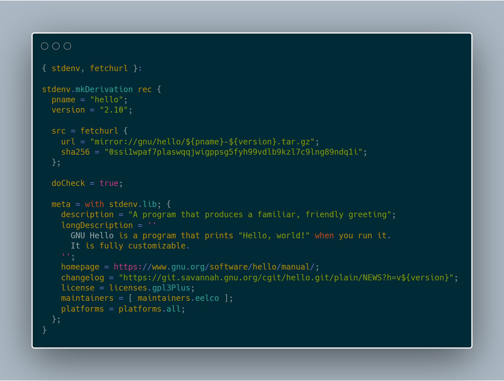

title: Nix: the Functional Package Manager
class: wrapper <!--, animation-fade-->
layout: true

---

class: center, middle

# {{title}}

---

class: center, middle

### <https://doomhammer.info/talks/lambdadays2020>

# Piotr Gaczkowski


<https://github.com/DoomHammer> | <svg aria-hidden="true" focusable="false"
data-prefix="fab" data-icon="twitter" class="svg-inline--fa fa-twitter fa-w-16"
role="img" xmlns="http://www.w3.org/2000/svg" viewBox="0 0 512 512" height="1em"><path fill="currentColor" d="M459.37 151.716c.325 4.548.325 9.097.325 13.645 0 138.72-105.583 298.558-298.558 298.558-59.452 0-114.68-17.219-161.137-47.106 8.447.974 16.568 1.299 25.34 1.299 49.055 0 94.213-16.568 130.274-44.832-46.132-.975-84.792-31.188-98.112-72.772 6.498.974 12.995 1.624 19.818 1.624 9.421 0 18.843-1.3 27.614-3.573-48.081-9.747-84.143-51.98-84.143-102.985v-1.299c13.969 7.797 30.214 12.67 47.431 13.319-28.264-18.843-46.781-51.005-46.781-87.391 0-19.492 5.197-37.36 14.294-52.954 51.655 63.675 129.3 105.258 216.365 109.807-1.624-7.797-2.599-15.918-2.599-24.04 0-57.828 46.782-104.934 104.934-104.934 30.213 0 57.502 12.67 76.67 33.137 23.715-4.548 46.456-13.32 66.599-25.34-7.798 24.366-24.366 44.833-46.132 57.827 21.117-2.273 41.584-8.122 60.426-16.243-14.292 20.791-32.161 39.308-52.628 54.253z"></path></svg> [@doomhammerng](https://twitter.com/doomhammerng)

<https://doomhammer.info>

---

class: center, middle, twitter

# Package Management is Hard

Which package manager do you use?

---

class: twitter, split75
background-image: url(img/element5-digital-fuZWqL1C2rM-unsplash.jpg)

.left-pane[
# Package Managers

- Apt-get, RPM, ...

- Homebrew

- pip, gem, npm, cabal, ...

- Docker

- Helm?
]

---

class: twitter
background-image: url(img/chuttersnap-fyaTq-fIlro-unsplash.jpg)

---

class: twitter
# Nix is Different

Nix is a domain-specific, purely functional, lazily-evaluated language

--

Nix-lang &ndash; the language

--

Nix &ndash; the software

--

Nixpkgs &ndash; the Package Repository

--

NixOS &ndash; the Operating System

---

class: twitter
# Nix features

- Operates in userland

- Deterministic packages and environments

- Atomic upgrades

- Rollbacks

- Build environment management

- Multiple versions of packages side-by-side on a single system

- Runs on Linux and macOS

---

class: twitter
# Functional approach

- Installing or upgrading package won't break other packages

- Every package is installed in a separate directory

- It allows easy rollback

- Prevents inconsistent state

---

class: nopadding, center


---

class: twitter
background-image: url(img/element5-digital-fuZWqL1C2rM-unsplash.jpg)

---

class: twitter
background-image: url(img/curology-pDsmoI5j3B8-unsplash.jpg)

---

class: twitter
# Good for multi-user environments

- Several users can install packages without superuser privileges

- Different users can have different package versions

---

class: twitter, split75
background-image: url(img/nix-cli.png)

# Package Manager

---

class: twitter
# Installing Remote Packages


---

class: twitter
# Using Nix Expressions

- Nix expressions are deterministic

--

- ... as far as network connectivity goes

---

class: twitter
# Rolling back

`nix-env --list-generations`

`nix-env --rollback`

`nix-env --switch-generation 3`

`nix-env -G 3`

---

class: twitter
# Nix Closures

Closures are packages with their dependencies.

Closure can be copied between systems.

They can be exported to files and imported later on.

Or they can be copied over SSH.

---

class: twitter, split50
background-image: url(img/javardh-0z7r3FIyXcE-unsplash.jpg)

.left-pane[
# `nix-shell`

Creates a Nix environment based on a Nix derivation and enters a shell inside
it.

Good for portable development environments.
]

---

class: twitter-right, split75-right
background-image: url(img/brett-jordan-MFLNpz5FZRk-unsplash.jpg)

.left-pane[
# `manifest.nix`

A list of all the software we have hoarded so far.
]

---

class: twitter
# Projects with direnv

Uses `nix-shell`.

Automatically sets up development environment whenever you enter a directory.

You can pin the packages version.

---

.envrc

```bash
use_nix
. env/bin/activate
```

default.nix

```nix
{ pkgs ? import <nixpkgs> {} }:

with pkgs;

let
  python = python37;
in
mkShell {
  buildInputs = [ python git gnumake ];
}
```

---

class: twitter
# Lorri

lorri is a nix-shell replacement for project development. lorri is based around fast direnv integration for robust CLI and editor integration.

---

# Using Nix in Standalone Scripts

```elixir
#! /usr/bin/env nix-shell
#! nix-shell -p "elixir"
#! nix-shell -i elixir
current_process = self()

# Spawn an Elixir process (not an operating system one!)
spawn_link(fn ->
  send(current_process, {:msg, "hello world"})
end)

# Block until the message is received
receive do
  {:msg, contents} -> IO.puts(contents)
end
```

---

class: twitter
# How Does it Compare to The Rest?

- Still not as easy as Homebrew

- GNU Guix using GNU Scheme (LISP)

- ... if you love parentheses, you'll love GUIX!

- ... also works with direnv!

---

# Inspiration

Asko Soukka @ PyCon PL 2019

<https://www.youtube.com/watch?v=Vnq6ngcqJAg>

---

class: center, middle

# Thank you!


<https://github.com/DoomHammer> | <svg aria-hidden="true" focusable="false"
data-prefix="fab" data-icon="twitter" class="svg-inline--fa fa-twitter fa-w-16"
role="img" xmlns="http://www.w3.org/2000/svg" viewBox="0 0 512 512" height="1em"><path fill="currentColor" d="M459.37 151.716c.325 4.548.325 9.097.325 13.645 0 138.72-105.583 298.558-298.558 298.558-59.452 0-114.68-17.219-161.137-47.106 8.447.974 16.568 1.299 25.34 1.299 49.055 0 94.213-16.568 130.274-44.832-46.132-.975-84.792-31.188-98.112-72.772 6.498.974 12.995 1.624 19.818 1.624 9.421 0 18.843-1.3 27.614-3.573-48.081-9.747-84.143-51.98-84.143-102.985v-1.299c13.969 7.797 30.214 12.67 47.431 13.319-28.264-18.843-46.781-51.005-46.781-87.391 0-19.492 5.197-37.36 14.294-52.954 51.655 63.675 129.3 105.258 216.365 109.807-1.624-7.797-2.599-15.918-2.599-24.04 0-57.828 46.782-104.934 104.934-104.934 30.213 0 57.502 12.67 76.67 33.137 23.715-4.548 46.456-13.32 66.599-25.34-7.798 24.366-24.366 44.833-46.132 57.827 21.117-2.273 41.584-8.122 60.426-16.243-14.292 20.791-32.161 39.308-52.628 54.253z"></path></svg> [@doomhammerng](https://twitter.com/doomhammerng)

<https://doomhammer.info>

### <https://doomhammer.info/talks/lambdadays2020>
