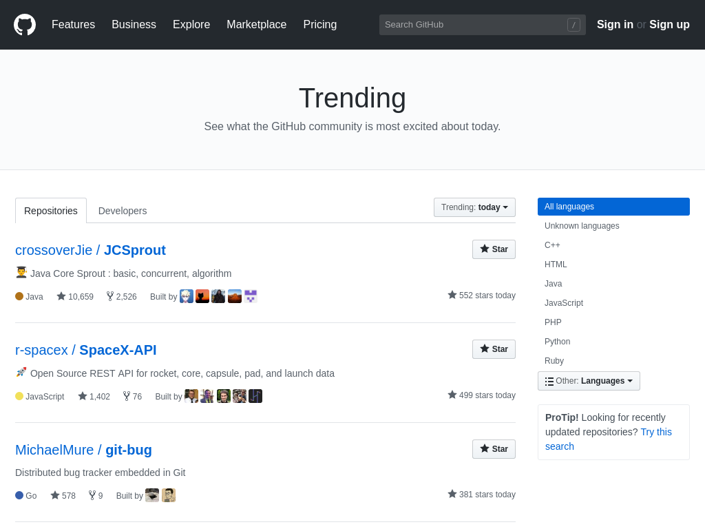

title: How to start contributing to Open Source?
class: animation-fade
layout: true

<!-- This slide will serve as the base layout for all your slides -->
<!--
.bottom-bar[
  {{title}}
]
-->

---

class: wrapper, center, middle

# {{title}}

---

class: wrapper, twitter
background-image: url(Gdansk_Licznik_rowerowy_Wrzeszcz.jpg)

???
# Początki bywają trudne.

## Analogia rowerowa

Kto z Was potrafi jeździć na rowerze?

Czy uważacie że jest w tym coś trudnego?

Obserwując codziennie ilu rowerzystów jeździ po Trójmieście można dojść do wniosku że nie ma nic prostszego niż prowadzenie tego środka transportu. Ciekaw jestem ilu z Was pamięta swoje początki? Rower trójkołowy albo czterokołowy, stopniowa nauka łapania równowagi wielokrotnie przypłacona obiciami, otarciami i innymi ranami.

---

class: wrapper, center, middle, twitter

## It's always hard in the beginning...

---

class: wrapper, twitter
background-image: url(maxresdefault.jpg)

???
Podobnie jest z udzielaniem się w projektach Open Source. Mnóstwo ludzi z całego świata dzieli się efektami swoich prac z całą społecznością. Patrząc na to co robią może nam się to wydawać łatwe. Sami jednak mamy zwykle opory przed tym by zacząć. Niesłusznie.

---

class: wrapper, center, middle, twitter

### <https://doomhammer.info/talks/ossummit2019>

# Piotr Gaczkowski

<https://github.com/DoomHammer> | [@doomhammerng](https://twitter.com/doomhammerng)

<https://doomhammer.info>

---

class: wrapper, center, middle, twitter

# What is Open Source?

---

class: wrapper, twitter
background-image: url(pexels-photo-461198.jpeg)

???

Jeśli jest na sali ktoś kto nie wie czym jest Open Source pozwolę sobie streścić zamysł. Oprogramowanie Open Source jest udostępniane nie tylko jako gotowy produkt (jak buritto w restauracji) który możemy skonsumować w istniejącej formie bez możliwości modyfikacji. Oprócz produktu dostajemy również kod źródłowy i instrukcję jego zbudowania. To odpowiednik listy produktów i przepisu kulinarnego. Jeśli uwielbiamy burrito ale nie jadamy mięsa, mając do dyspozycji listę składników i przepis jesteśmy w stanie zastąpić mięso dowolnym innym składnikiem.

---

class: wrapper, twitter
background-image: url(avocado.jpg)

???

Na przykład awokado. Po spróbowaniu takiego burrito z awokado może okazać się że jest ono lepsze od mięsnego wariantu z naszej ulubionej restauracji. Możemy więc przekazać im ten przepis albo opublikować go samemu. Wariant pierwszy odpowiada zgłoszeniu propozycji zmian w oryginalnym projekcie, wariant drugi to publikacja tzw. forka, tudzież odgałęzienia. Osobnego projektu którego historia do pewnego momentu tożsama jest z historią projektu oryginalnego. Potęgą takiego podejścia jest to, że każdy użytkownik ma możliwość uczynić produkt lepszym dla wszystkich podobnych mu odbiorców.

---

class: wrapper, twitter
background-image: url(firefox.jpg)

---

class: wrapper, center, middle, twitter

## What are the possible contributions?

???

Zanim ci z Was dla których "kod źródłowy" i "kompilacja" brzmią zbyt strasznie opuszczą salę chciałbym zauważyć, że udzielanie się w Open Source nie wymaga znajomości programowania. Przyjrzyjmy się z czego składa się produkt:

---

class: wrapper, twitter

1. Source code of the important features

--

2. User interface (UI), graphic design

???

Dla tych którzy gardzą graficznymi interfejsami przypominam że programy konsolowe również mają swój interfejs zaś niemal wszystkie edytory posiadają interfejs graficzny

--

3. User interactions, usability, User eXperience (UX)

--

4. Media (sounds, video)

--

5. Text interface, copy, translations

--

6. Marketing

--

7. Legal support

???

Jeśli jesteś w stanie pomóc w którejś z powyższych kategorii, nie ma przeciwwskazań by zacząć udzielać się w Open Source.

---

class: wrapper, center, twitter

## I am not a creator

???

Są dwa główne sposoby udzielania się w Open Source. Możemy zgłosić swój pomysł, propozycję ulepszenia, bądź raport błędu w odpowiednie miejsce i obserwować wątek licząc że ktoś wdroży naszą propozycję lub naprawi błąd. Jest to metoda szczególnie polecana jeśli wydaje nam się że wiemy jak coś powinno wyglądać ale brakuje nam kompetencji by to zrobić samodzielnie. Drugi sposób to wysłanie konkretnych propozycji zmian które jeśli przejdą recenzję i kontrolę jakości mogą trafić do kolejnego wydania interesującego nas produktu.

Jeśli korzystając z Firefox znajdziemy gdzieś literówkę możemy albo zgłosić to jako błąd "hej, napisaliście dpua z błędem" albo znaleźć odpowiednie pliki zawierające tłumaczenia, poprawić literówkę samodzielnie a następnie wysłać nasze zmiany do recenzji.

---

class: wrapper, center, middle, twitter

# Why is contributing to Open Source worth your time?

---

class: wrapper, twitter

## Increase your skills

???

Współtworząc Open Source możemy wykorzystać swoje umiejętności w praktyce. Dzięki temu że nasz udział jest poddawany recenzji możemy także uczyć się od innych.

Pracujesz jako developer COBOL, ale całe życie marzyłaś żeby zajmować się UX? Dołącz do projektu Open Source, rozwiń swoje umiejętności i dołącz ten projekt do CV!

--

## Improve your visibility

???

Im więcej się udzielamy tym lepsza nasza widoczność. To z kolei oznacza większą sieć potencjalnych kontaktów i większe grono odbiorców naszych *pozostałych* kanałów (blog, kanał YouTube, LinkedIn, produkty komercyjne). Co za tym idzie?

--

## Find a new job (or new clients)

???

Jeśli komuś spodoba się to w jaki sposób piszemy kod może zechcieć zaprosić nas na rozmowę.

--

## Find new employees

???

Jeśli komuś spodoba się to jakie projekty tworzymy może zechcieć dla nas pracować.

--

## Do something for others (gaining their gratitude)

???

Robicie coś dla siebie, pomagacie innym. Inni są Wam wdzięczni, łapiecie endorfiny i jest błogo. Efekt podobny jak po zjedzeniu tabliczki czekolady, niemniej bardziej rozwijający.

---

class: wrapper, twitter

## Get nice statistics

---

class: wrapper, center, middle, twitter

# How to find your first project?

???

---

class: wrapper, twitter

## Popular projects

https://github.com/search?q=stars:%3E1&s=stars&type=Repositories

???

https://github.com/search?q=stars:%3E1&s=stars&type=Repositories

Wśród popularnych projektów Open Source możemy wspomnieć o Android, Firefox, Chromium (czyli wersji Google Chrome pozbawionej brandingu i kilku innych własnościowych elementów), Kubernetes, Docker, TensorFlow, Atom, Notepad++.

Jest spora szansa że ktoś z Was korzysta z nich na codzień. Być może wiecie o ich irytujących przypadłościach lub macie pomysł jak sprawić by były lepsze. Wasz udział mógłby pomóc milionom potencjalnych odbiorców. Czy zatem powinniście zakasać rękawy i napisać zgłoszenie błędu albo wysłać łatkę do któregoś z powyższych projektów? Nie polecam tej drogi.

Te projekty są ogromne. Mają całe rzesze opiekunów i jescze większe grona użytkowników. Każdego dnia zgłaszane są rozliczne propozycje zmian które trzeba recenzować, poddawać kontroli jakości a przede wszystkim oceniać ich sensownośc i zgodność z wizją produktu. Jest spora szansa, że nasze cenne uwagi przez długi czas pozostaną niewysłuchane. To sprawi, że nasz początkowy entujazm opadnie i łatwo zrazimy się do kolejnych prób. Nasz mózg lubi natychmiastowe wynagrodzenie. Spróbujmy to wykorzystać!

---

class: wrapper, twitter

## Trending projects

https://github.com/trending

---

class: wrapper, twitter
background-image: url(awesome.svg)
background-size: contain

## `awesome` projects

https://github.com/sindresorhus/awesome#readme

https://github.com/hackerkid/Mind-Expanding-Books#readme

???

Alternatywą wymagająca najmniej wysiłku jest przejrzenie listy https://github.com/sindresorhus/awesome która wskazuje na inne listy tematyczne. Jest to odpowiednik Wikipedii pozwalający dowolnym osobom dodawać informacje uważane przez nie za ciekawe. Nie wymaga znajomości kodowania, wymaga jedynie wiedzy o czyms wystarczająco fajnym by podzielić się z innymi. Przykład? https://github.com/hackerkid/Mind-Expanding-Books#readme

---

class: wrapper, twitter

## Following your 💚

---

class: wrapper, twitter

## Events

- [Hacktoberfest](https://hacktoberfest.digitalocean.com/)

- [Google Summer of Code](https://summerofcode.withgoogle.com/)

???

Ostatnim ze sposobów jest wzięcie udziału w imprezie typu https://hacktoberfest.digitalocean.com/ bądź https://summerofcode.withgoogle.com/ gdzie prezentowane są sugestie projektów w których warto się udzielać. Dla osób o niskiej pewności siebie: wystarczy przejrzeć listy z lat ubiegłych bez konieczności brania udziału w imprezie.

---

class: wrapper, center, middle, twitter

# How to tell if a contribution is valuable?

---

class: wrapper, twitter

- Respect how others work, especially if you offer your help

???

Przede wszystkim przed zgłoszeniem błędu, sugestii lub poprawki sprawdźmy czy ktoś nie zrobił tego wcześniej.

Po drugie wiele projektów posiada dokuemtny takie jak `CONTRIBUTORS.md` w których opisane są warunki współpracy.

https://github.com/dlabspl/zombie-nginx#contributing

Po trzecie niektóre szablony zgłoszeń posiadają wypisane punkty które musimy spełnić zanim wyślemy zgłoszenie. Przeczytajmy je ze zrozumieniem i upewnijmy się że spełniamy odpowiednie standardy.

--

- Consider whether your contribution brings value to others

???

Czasami nasz świetny pomysł może niezwykle sprytny i zmyślny, ale niekoniecznie wnosi wartość także dla innych. W skrajnych przypadkach może powodwoać spadek wartości. Jeśli będziemy jedynymi odbiorcami danej funkcji prawdopodobieństwo przyjęcia naszej poprawki jest mniejsze. Jeśli odpowiadamy na rzeczywiste zapotrzebowanie społeczności, nasze szanse rosną.

--

- Be verbose, a long post is better than a lengthy discussion

???

Raport błędu powinien być na tyle szczegółowy by odbiorca znał doskonale kontekst i zamierzone cele użytkownika, ale bez popadania w zbytnią narrację.

Przy zgłaszaniu poprawki wyjśnijmy: co ma ona dawać, jakie są przeiwdywane przypadki użycia, kto może na tym skorzystać. Wepchnięcie komuś pod nos serwetki z napisem `2 + 2 = 4` raczej nie zjedna nam sobie przyjaciół. Co innego gdy opatrzysz to: "stary, masz błąd w czwartym ćwiczeniu, lepiej to popraw jeśli chcesz mieć dobrą ocenę".

--

- Run, test, check before you submit

???

Po raz kolejny temat utrzymania standardów. Ostatnią rzeczą którą chcą zobaczyć opiekunowie projektów Open Source to kawałek kodu który się nei kompiluje bądź nie przechodzi testów. Weźmy pod uwagę że opiekunowie zwykle przeglądają o rząd wielkości więcej zmian niż my wystawiamy. Szanujmy ich czas i swoje nerwy.

---

class: wrapper, center, middle, twitter

# How to avoid depression online?

---

class: wrapper, twitter

- Our best ideas are not the best to everyone

???

Nawet jeśli wymyśliliśmy najlepszy na świecie otwieracz do konserw i znajduja się osoby które uważają że taki otwieracz jest rzeczywiście potrzebny, nie możemy mieć za złe producentowi garniturów że nie chce tego otwieracza dołączać do swoich szytych na miarę zamówień.

Projekty Open Source nie oznaczają, że każdy ma takie samo prawo głosu i każda sugestia może przejść. Ostatecznie to na opiekunów spada ciężar późniejszego utrzymania produktu.

--

- Our best work may not meet the quality standards

???

Poruszane już wcześniej. Możemy trafić na projekt w którym opiekunowie mają *bardzo* wysokie standardy dotyczące np. czytelności kodu. Mimo iż damy z siebie wszystko nasza poprawka i tak wróci do nas po recenzji, czasami kilkukrotnie.

Uwaga: udzielanie się w takich projektach może być bardzo wartościowe! Nauczymy się dobrych praktyk szybciej niż gdziekolwiek indziej!

--

- What to do when you hear "no"?

???

Czasami słusznie, czasami być może niesłusznie zdarzy nam się otrzymać odpowiedź negatywną. "Nie naprawimy tego błędu", "nie potrzebujemy tej poprawki", "ta sugestia wykracza poza zakres projektu". Nie podchodźmy do tej sprawy osobiście. O ile nie mamy na to dowodów powodem odmowy najpewniej nie było to że opiekunowie projektu nas nie lubią. Mogę po prostu mieć odmienną wizję od naszej. Uszanujmy to i spróbujmy ich lepiej zroumieć.

Warto zapytać się jaki jest powód odmowy. Być może jesteśmy w stanie wyciągnąc z tego lekcję i przy kolejnym zgłoszeniu do tego samego projektu zostać zaakceptowani. Być moe tę wiedzę wykorzystamy gdzie indziej.

--

- How to deal with trolls?

[The Complete Guide to Understanding and Dealing with Online Trolls](https://betterhumans.coach.me/the-complete-guide-to-understanding-and-dealing-with-online-trolls-4a606ae25c2c)

???

Najgorszy i jednocześnie najtrudniejszy punkt dotyczący niemal każdych naszych działań online. Bardziej podatni są tu opiekunowie projektów niż osoby zgłaszające pojedyncze poprawki, ale istnieje prawdopodobieństwo że sami staniemy się ofiarami takich ataków. Ponieważ sam nie mam z tym dużego doświadczenia polecam artykuł na [Better Humans](https://betterhumans.coach.me/the-complete-guide-to-understanding-and-dealing-with-online-trolls-4a606ae25c2c).

---

class: wrapper, center, middle, twitter

# How to make money on Open Source?

---

class: wrapper, center, middle, twitter

## Donations, patronage, crowdfunding

---

class: wrapper, twitter

### Continuous

- Paypal Button

https://doomhammer.github.io/songcorder/#tips-welcome

???

Vide: https://doomhammer.github.io/songcorder/

--

- Flattr

--

- Gittip/Gratipay/[Liberapay](https://en.liberapay.com/explore/repositories)

--

- Patreon

---

class: wrapper, twitter

background-image: url(songcorder_tip.png)
background-size: contain

---

class: wrapper, twitter

background-image: url(liberapay.png)
background-size: contain

---

class: wrapper, twitter

background-image: url(patreon.png)
background-size: contain

---

class: wrapper, twitter

### One-time

- Kickstarter

https://www.kickstarter.com/projects/aiforeveryone/mycroft-mark-ii-the-open-voice-assistant

--

- IndieGoGo

https://www.indiegogo.com/projects/geary-a-beautiful-modern-open-source-email-client

--

- Self-managed

https://mediagoblin.org/pages/campaign.html

---

class: wrapper, twitter

## Paid internship

- https://summerofcode.withgoogle.com/

---

class: wrapper, twitter

## Companies developing Open Source

--

- Check the sponsors list

--

- Look around you!

---

class: wrapper, twitter

## Others

### Bounty hunters

https://www.bountysource.com/

### Grants

https://foundation.travis-ci.org/grants

https://www.mozilla.org/en-US/grants/

---

class: wrapper, twitter

## Others

### Lemonade stand

https://github.com/nayafia/lemonade-stand

---

class: wrapper, center, middle

# Thank you!

<https://github.com/DoomHammer> | [@doomhammerng](https://twitter.com/doomhammerng)

<https://doomhammer.info>

### <https://doomhammer.info/talks/ossummit2019>
