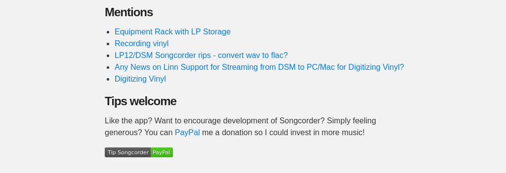
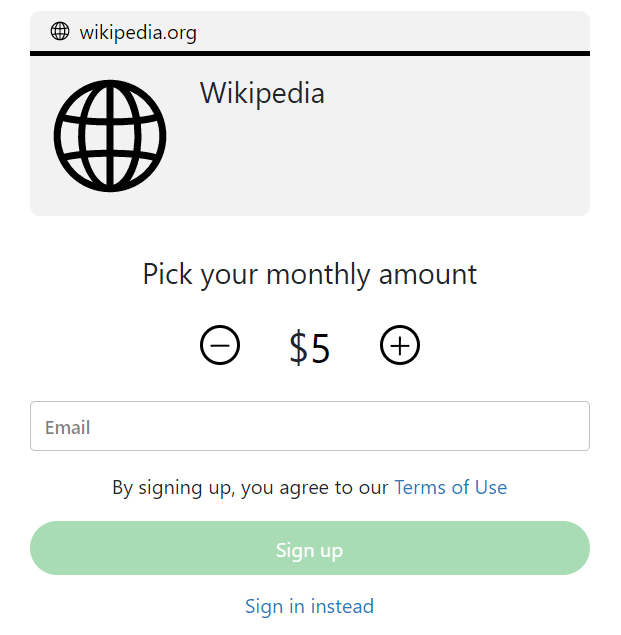
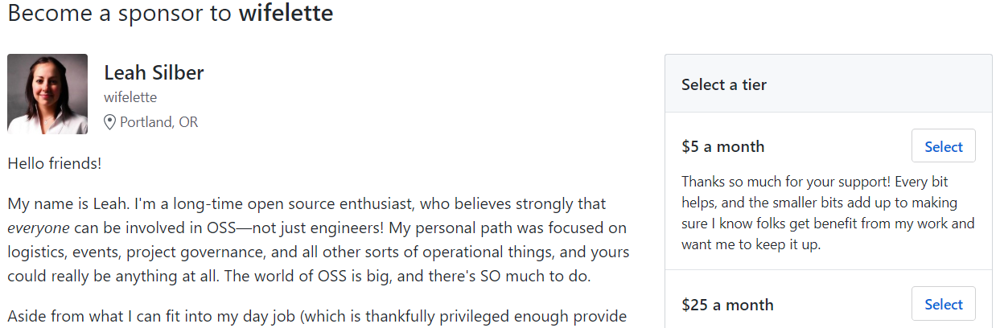
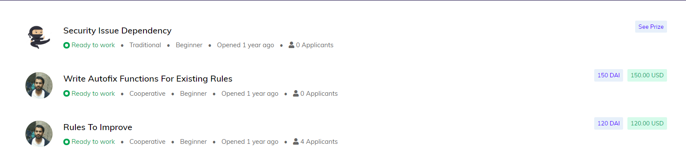

title: How to make money on Open Source?
class: animation-fade, wrapper
layout: true

<!-- This slide will serve as the base layout for all your slides -->
<!--
.bottom-bar[
  {{title}}
]
-->

---

class: center, middle

# {{title}}

---

class: center, middle, twitter

### <https://doomhammer.info/talks/sfscon2019>

# Piotr Gaczkowski

<https://github.com/DoomHammer> | [@doomhammerng](https://twitter.com/doomhammerng)

<https://doomhammer.info>

---

class: center, middle, twitter

# Why is contributing to Open Source worth your time?

---

class: twitter

## Increase your skills

--

## Improve your visibility

--

## Find a new job (or new clients)

--

## Find new employees

--

## Do something for others (gaining their gratitude)

---

class: twitter

## Get nice statistics

---

class: center, middle, twitter

# How to make money on Open Source?

---

class: center, middle, twitter

## Donations, patronage, crowdfunding

---

class: twitter

### Continuous

- Paypal Button

<https://doomhammer.github.io/songcorder/#tips-welcome>

---

class: twitter

### Continuous

- Flattr

---

class: twitter

### Continuous

- Gittip/Gratipay/[Liberapay](https://en.liberapay.com/explore/repositories)

---

class: twitter

### Continuous

- Patreon

---

class: twitter

### Continuous

- GitHub Sponsors

---

class: twitter

### One-time

- Kickstarter

<https://www.kickstarter.com/projects/aiforeveryone/mycroft-mark-ii-the-open-voice-assistant>

---

class: twitter

### One-time

- IndieGoGo

<https://www.indiegogo.com/projects/geary-a-beautiful-modern-open-source-email-client>

---

class: twitter, split75
background-image: url(mediagoblin.png)

.left-pane[
### One-time

- Self-managed

<https://mediagoblin.org/pages/campaign.html>
]

---

class: twitter

## Paid internship

- <https://summerofcode.withgoogle.com/>

- <https://developers.google.com/season-of-docs>

---

class: twitter

## Grants

- <https://foundation.travis-ci.org/grants>

- <https://www.mozilla.org/en-US/grants/>

---

class: twitter

## Companies developing Open Source

--

- See the sponsors list

---

class: twitter

## Bounty hunts

- <https://www.bountysource.com/>

- <https://issuehunt.io>

---

class: twitter

## Gitcoin

---

class: twitter

## Lemonade stand

<https://github.com/nayafia/lemonade-stand>

## OSS Fund

<https://oss.fund>

---

class: twitter

# Problems related to Open Source funding

- Awareness

--

- Trust

--

- Lack of standards / Too much choice

---

class: twitter, middle, center

# Why is it important?

---

class: twitter, middle, center

# What can we do about it?

---

class: center, middle

# Thank you!

<https://github.com/DoomHammer> | [@doomhammerng](https://twitter.com/doomhammerng)

<https://doomhammer.info>

### <https://doomhammer.info/talks/sfscon2019>
